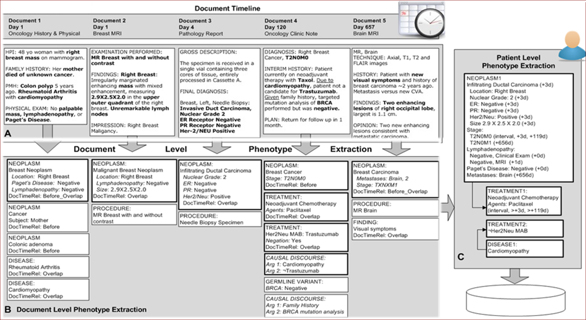

DeepPhe
=======

# Cancer Deep Phenotype Extraction (DeepPhe) Translational Project
## Introduction v0.4.0

This documentation describes v0.4.0 of
* the DeepPhe Translational base system, which 
    - is built upon [Apache cTAKES](ctakes.apache.org)&#8482;.
    - extracts cancer-related information from plaintext documents.
    - summarizes information for Cancers and Tumors across multiple documents.
    - writes results to a [Neo4j](https://neo4j.com/) database.
    - requires the [Java 8 development kit](https://www.oracle.com/java/technologies/javase/javase-jdk8-downloads.html).
      - DeepPhe will not run on Java versions 9 and greater.
    - requires [Neo4j 3.5](https://neo4j.com/docs/operations-manual/3.5/).
      - DeepPhe will not run on Neo4j versions 4 and greater.
* and the [DeepPhe Data Visualizer](https://github.com/DeepPhe/DeepPhe-Viz-v2), for visualizing the cancer patient summaries generated by the DeepPhe system.

The system has been tested using documents from several cancer domains, including:
* Breast Cancer
* Ovarian Cancer
* Malignant Melanoma

Here is a pictorial example of DeepPhe processing five documents for a single patient, and summarizing the cancer information from the five documents. Some of the attributes, such as the tumor size and treatment, show future direction of DeepPhe beyond version 0.4.0.

## Quick Start
1. Obtain the code of the base DeepPhe Translational system using one of three methods:
   - Download a [zip file](https://github.com/DeepPhe/DeepPhe-Release/archive/refs/heads/Translational-v0.4.0.zip).
   - Clone this [branch](https://github.com/DeepPhe/DeepPhe-Release.git).
   - Visit the [Release page](https://github.com/DeepPhe/DeepPhe-Release/releases/tag/Translational-v0.4.0).
2. Install version 3.5 of [Neo4j](https://neo4j.com/download-center/).
   - This release of DeepPhe requires [neo4j 3.5.x](https://neo4j.com/docs/operations-manual/3.5/). WARNING - do not simply download the latest version of neo4j.
3. Install a binary installation of the DeepPhe Translational base system:
   - on Windows, execute the build.bat script in the root directory of the source code.
   - on Linux, follow the instructions in [linux-build-and-run](linux-build-and-run/README.md) starting with step #2.
4. Install the [DeepPhe Data Visualizer](https://github.com/DeepPhe/DeepPhe-Viz-v2).
   - The DeepPhe Data Visualizer works best on Linux.
     - Scripts in [linux-build-and-run](linux-build-and-run/README.md) can also be used to install and run the Visualizer.

## Using DeepPhe
1. [Name](../../wiki/Naming-Input-Files) the files you would like to process (Optional).
2. Start the [Neo4j server](https://neo4j.com/docs/operations-manual/3.5/).   
3. Run the DeepPhe Translational base system using one of three methods:
   - Start a GUI that can run the system by executing bin\runDeepPheGui.
   - Run the system by executing bin\runDeepPhe.   Command-line parameters are required to run in this manner:
     -   InputDirectory (-i)     The directory containing clinical notes.
     -   OutputDirectory (-o)    The directory to which output should be written.
     -   StartNeo4j (-n)         Location of the Neo4j installation.  Do not use this if you do not wish to auto-start Neo4j.  If you use this option then the neo4j server will remain active after the pipeline ends.
     -   Neo4jUri (-r)           URI for the Neo4j Server.  Normally "bolt://127.0.0.1:7687"
     -   Neo4jUser (--user)      The username for Neo4j.  Normally "neo4j".
     -   Neo4jPass (--pass)      The password for Neo4j.  Normally "neo4j" until you change it.
   - If you are a developer, run using available Apache cTAKES Java classes for [Piper Files](https://cwiki.apache.org/confluence/display/CTAKES/Piper+Files).
4. View the results using [DeepPhe Data Visualizer](https://github.com/DeepPhe/DeepPhe-Viz-v2).

## Licensing
DeepPhe is provided under an [Academic Software Use Agreement](LICENSE)  
Refer to that agreement for information about requesting the use of the Software for commercial purposes.

DeepPhe includes portions of the HemOnc.org ontology. Refer to [HemOnc.org](https://hemonc.org/wiki/Ontology) regarding the licensing of the HemOnc.org ontology.

DeepPhe includes portions of the [NCI Thesaurus](https://ncit.nci.nih.gov/ncitbrowser/) (NCIt).

Other licenses for your reference  
    &nbsp;&nbsp; - [Apache cTAKES](https://ctakes.apache.org/license.html)&#8482;
    &nbsp;&nbsp; - [Neo4j](https://neo4j.com/docs/license/)  

## Contact / Help
_Please drop us a note if you obtain the code, by posting to the [DeepPhe group]( https://groups.google.com/forum/#!forum/deepphe)_.

Metrics on downloads and usage could help us with funding future enhancements.

For questions, contact us via the [DeepPhe group]( https://groups.google.com/forum/#!forum/deepphe).
