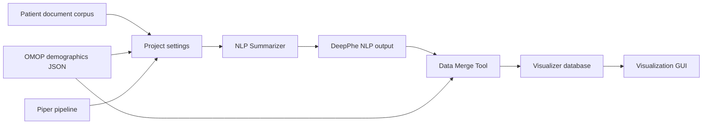

import useBaseUrl from '@docusaurus/useBaseUrl';

The DeepPhe Desktop GUI is the launcher for the local DeepPhe workflow. Use it to choose a project, point DeepPhe at a text corpus and OMOP demographics file, run the NLP summarizer, merge the output into a visualization database, and open the cohort visualizer.

## The Main Buttons

  

    
    <strong>NLP Summarizer</strong>
    Runs the selected Piper pipeline over the selected corpus and writes DeepPhe output to the project output directory.
  

  

    
    <strong>Data Merge Tool</strong>
    Combines NLP output and OMOP demographics into the database used by the visualization services.
  

  

    
    <strong>Visualization GUI</strong>
    Starts the local Data API and visualizer, then opens the visualizer in your browser.
  

  

    
    <strong>Wiki</strong>
    Opens DeepPhe manuals and release documentation.
  

  

    
    <strong>Web Site</strong>
    Opens the public DeepPhe site.
  

## Typical Session

1. Launch the DeepPhe Desktop GUI.
2. Select or create a project.
3. Confirm the Piper file, corpus directory, OMOP database JSON, and output directory.
4. Click NLP Summarizer.
5. Click Data Merge Tool.
6. Click Visualizer Startup to open the browser-based visualizer.
7. Click Visualizer Shutdown when finished.

The activity log at the bottom of the window shows commands, startup progress, errors, and the location of tool logs.
